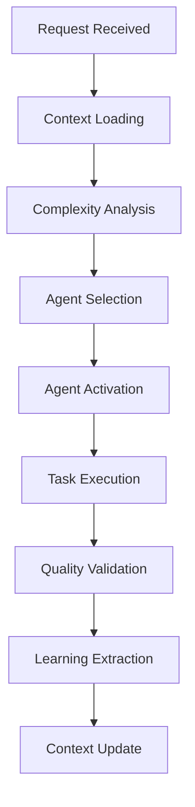

# CCE System Architecture

This document provides a comprehensive overview of the Context & Coordination Engine (CCE) architecture.

## 🏗️ High-Level Architecture

```
┌─────────────────────────────────────────────────────────┐
│                    Claude Code CLI                       │
├─────────────────────────────────────────────────────────┤
│                    CCE Core Engine                      │
│  ┌───────────────┐ ┌─────────────┐ ┌─────────────────┐ │
│  │   Context     │ │ Orchestrator│ │    Learning     │ │
│  │   Manager     │ │   Engine    │ │    System       │ │
│  └───────────────┘ └─────────────┘ └─────────────────┘ │
├─────────────────────────────────────────────────────────┤
│                  Agent Ecosystem                        │
│  ┌─────┐ ┌─────┐ ┌─────┐ ┌─────┐ ┌─────┐ ┌─────┐ ... │
│  │ CCE │ │Front│ │Back │ │Test │ │Sec. │ │Plan │     │
│  │Agent│ │ End │ │ End │ │ ing │ │Agent│ │Agent│     │
│  └─────┘ └─────┘ └─────┘ └─────┘ └─────┘ └─────┘     │
├─────────────────────────────────────────────────────────┤
│                  Storage Layer                          │
│  ┌─────────┐ ┌─────────┐ ┌─────────┐ ┌─────────────┐   │
│  │Context  │ │Sessions │ │Patterns │ │  Projects   │   │
│  │ Store   │ │  Store  │ │  Store  │ │   Store     │   │
│  └─────────┘ └─────────┘ └─────────┘ └─────────────┘   │
└─────────────────────────────────────────────────────────┘
```

## 🧠 Core Components

### 1. Context Manager

**Responsibility**: Aggregates and maintains context from multiple sources

**Context Sources:**
- **Code Context**: File structure, patterns, dependencies, architecture
- **Project Context**: Git history, documentation, build configurations
- **User Context**: Preferences, interaction history, quality expectations
- **Environment Context**: System capabilities, constraints, deployment targets
- **Global Context**: Best practices, community patterns, security standards

**Context Files:**
- `~/.claude/cce/context/current.json` - Current project context
- `~/.claude/projects/{project_id}/KNOWLEDGE_BASE.md` - Project-specific learnings
- `~/.claude/cce/patterns/` - Successful implementation patterns

### 2. Orchestrator Engine

**Responsibility**: Intelligent agent selection and workflow coordination

**Selection Algorithm:**
```python
def select_agents(request, context):
    # Analyze request complexity
    complexity = analyze_complexity(request)
    
    # Extract domain keywords
    domains = extract_domains(request)
    
    # Consider historical performance
    performance_weights = get_historical_performance(domains)
    
    # Apply context filters
    context_relevance = filter_by_context(context, domains)
    
    # Generate agent recommendation
    return recommend_agents(complexity, domains, performance_weights, context_relevance)
```

**Orchestration Patterns:**
- **Sequential**: For dependent tasks requiring ordered execution
- **Parallel**: For independent tasks that can run concurrently
- **Hierarchical**: Complex workflows with primary and supporting agents
- **Iterative**: Multi-round refinement with feedback loops

### 3. Learning System

**Responsibility**: Continuous improvement through pattern extraction and application

**Learning Triggers:**
- Task completion (success/failure analysis)
- User feedback (preference learning)
- Performance metrics (optimization opportunities)
- Error patterns (anti-pattern identification)

**Learning Outputs:**
- Successful implementation patterns
- Anti-patterns to avoid
- User preference profiles
- Quality standard calibration
- Agent performance metrics

## 🗄️ Storage Architecture

### Context Storage
```
~/.claude/cce/context/
├── current.json           # Active project context
├── compressed/            # Compressed historical context
└── cache/                 # Temporary context cache
```

### Session Management
```
~/.claude/cce/sessions/
├── current.json           # Active session state
├── history/               # Historical sessions
└── backups/               # Session backups
```

### Pattern Storage
```
~/.claude/cce/patterns/
├── successful/            # Proven successful patterns
├── experimental/          # Patterns being validated
└── deprecated/            # Outdated patterns
```

### Project Storage
```
~/.claude/projects/
├── {project_id}/
│   ├── KNOWLEDGE_BASE.md  # Project-specific learnings
│   ├── context.json       # Project context
│   ├── patterns.json      # Project patterns
│   └── metrics.json       # Performance metrics
└── registry.json          # Project registry
```

## 🔄 Agent Lifecycle

### 1. Agent Registration
```yaml
agent_definition:
  name: "agent-name"
  description: "Agent purpose and capabilities"
  tools: ["Read", "Write", "Edit", "Bash", ...]
  triggers: ["keyword1", "keyword2", ...]
  priority: 1-10
  quality_gates: ["intent", "quality", "performance", ...]
```

### 2. Agent Activation


### 3. Agent Coordination
- **Message Passing**: Agents communicate through structured messages
- **Context Sharing**: Shared context ensures consistency
- **Quality Gates**: Each agent validates outputs before handoff
- **Error Handling**: Graceful degradation and error recovery

## 🎯 Quality System

### Multi-Dimensional Validation
Each implementation is validated across:
- **Intent Alignment** (30%): Solves the actual problem
- **Code Quality** (25%): Maintainable, readable, secure
- **Performance** (20%): Efficient and scalable
- **Security** (15%): Secure by default
- **Integration** (10%): Compatible with existing systems

### Adaptive Standards
Quality requirements adapt to context:
```yaml
quality_profiles:
  enterprise:
    minimum_score: 90
    required_dimensions: all
    mandatory_reviews: [security, performance, integration]
    
  startup:
    minimum_score: 75
    required_dimensions: [intent, quality, security]
    focus: speed_to_market
    
  prototype:
    minimum_score: 60
    required_dimensions: [intent, quality]
    focus: exploration
    
  learning:
    minimum_score: 70
    required_dimensions: [intent, quality, learning_value]
    focus: education
```

## 🔒 Security Architecture

### Context Isolation
- Each project maintains isolated context
- Sensitive information never shared between projects
- Context encryption for sensitive projects

### Agent Sandboxing
- Agents operate within defined tool boundaries
- No cross-agent direct access to sensitive data
- All agent actions logged and auditable

### Data Protection
- Local storage only - no external data transmission
- Encrypted storage for sensitive context
- Automatic cleanup of temporary data

## ⚡ Performance Optimization

### Context Compression
- Historical context compressed for storage efficiency
- Smart loading - only relevant context loaded per request
- Incremental updates to minimize processing overhead

### Agent Caching
- Frequently used patterns cached in memory
- Agent selection results cached for similar requests
- Context analysis results cached temporarily

### Parallel Processing
- Independent agents execute in parallel
- Context loading and analysis parallelized
- Pattern matching optimized with indexing

## 🔧 Configuration & Extensibility

### Agent Configuration
```yaml
# ~/.claude/cce/config/agents.yaml
agents:
  frontend-agent:
    enabled: true
    priority: 5
    custom_tools: ["CustomReactTool"]
    quality_weights:
      performance: 0.3
      accessibility: 0.2
```

### Custom Patterns
```yaml
# ~/.claude/cce/config/patterns.yaml
custom_patterns:
  react_component:
    trigger_keywords: ["component", "react"]
    template_path: "patterns/react-component.template"
    validation_rules: ["typescript", "accessibility"]
```

### Integration Points
- **IDE Integration**: VS Code extension support
- **Git Hooks**: Automatic context updates on commits
- **CI/CD Integration**: Quality gate integration in pipelines
- **External Tools**: Plugin system for custom tools

## 📈 Monitoring & Analytics

### Performance Metrics
- Agent selection accuracy
- Task completion success rates
- Context loading performance
- Pattern application effectiveness

### Quality Metrics
- Code quality scores over time
- Security vulnerability detection rates
- Performance improvement tracking
- User satisfaction indicators

### Learning Metrics
- Pattern discovery rates
- Knowledge base growth
- Cross-project learning effectiveness
- Recommendation accuracy improvement

## 🚀 Scalability Considerations

### Horizontal Scaling
- Multiple project support with isolated contexts
- Team collaboration through shared pattern libraries
- Distributed agent execution for large teams

### Vertical Scaling
- Intelligent context pruning for large codebases
- Pattern hierarchy for complex domains
- Adaptive quality standards based on project size

### Future Extensibility
- Plugin architecture for custom agents
- API for external integrations
- Machine learning integration for pattern discovery
- Distributed knowledge base synchronization